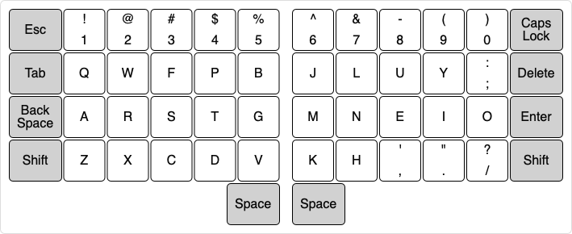

# Colemak-DHS

This is a Colemak-DH modification for Steimo keyboard.

Most of the changes are related to the Steimo keyboard layout [functional guidelines](layout.md#functional-guidelines). They involve punctuation, symbols, and [edge keys](glossary.md#edge-keys). Letters and numbers remain unchanged.

## Changes

* Replace extra `Backspace` with `Caps Lock`.
* Replace backtick `` ` `` and tilde `~` with `Escape`.
* Replace backslash `\` and pipe `|` with `Delete`.
* Replace asterisk `*` with minus `-`.
* Replace open angle bracket `<` with single quote `'`.
* Replace close angle bracket `>` with double quote `"`.

## Layout

