# Comparison with the Conventional Keyboard

Steimo keyboard layout is an evolution, rather than a revolution, of the conventional keyboard.

## Size

* The height of the conventional keyboard is between 6u and 6.5u, while Steimo is 6.25u.
* The width of the full-size conventional keyboard is 22.5u, while Steimo LR34 is 20.25u.
* The width of the main block, or 60% conventional keyboard, is 15u, while Steimo LR is 12.75u and Steimo LR3 is 16u.
* The number of keys in ANSI full-size conventional keyboard is 104, while Steimo LR34 is 112.
* The number of keys in ANSI TKL conventional keyboard is 87, while Steimo LR3 is 88.

## Changes

### 1. Resize the keys on the left and right edges of the main block to 1.25u.

This makes the keys uniform in size and thus removes staggering.

Before:

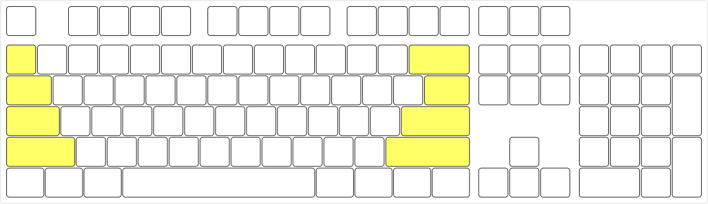

After:

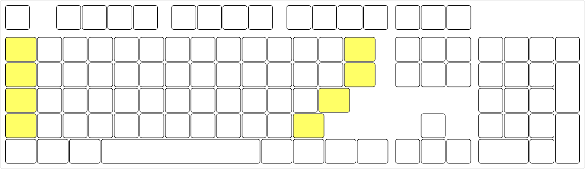

### 2. Split the main block into two sections.

This creates the left-hand and right-hand modules.

Before:

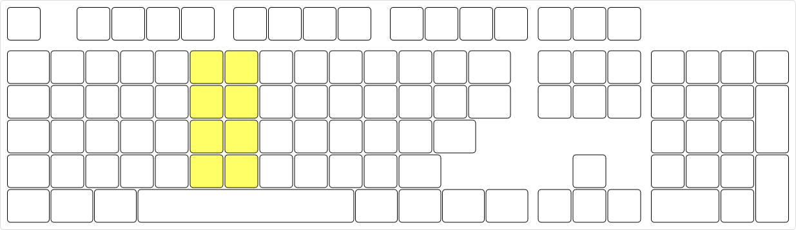

After:

### 3. Move some keys from the right-hand module to the navigation block.

This makes the middle rows of the left-hand and right-hand modules symmetrical. The navigation block becomes the three-column module.

Before:

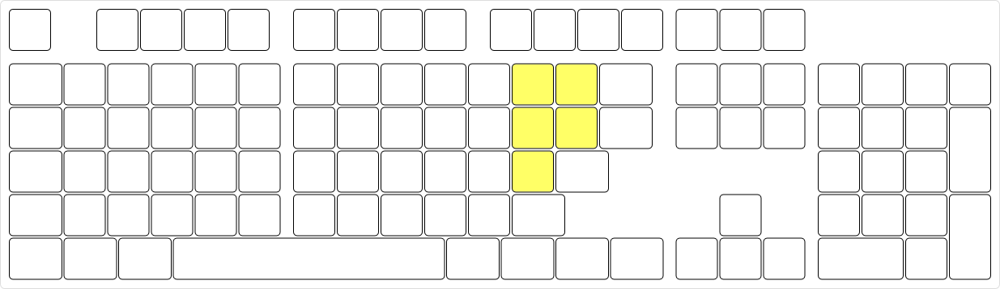

After:

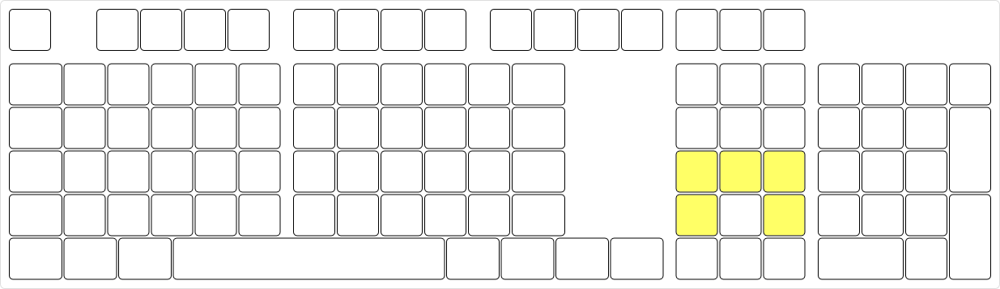

### 4. Arrange the top row keys.

This makes the top row of the left-hand and right-hand modules symmetrical. One key is removed in the process.

Before:

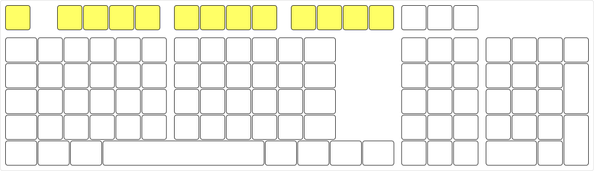

After:

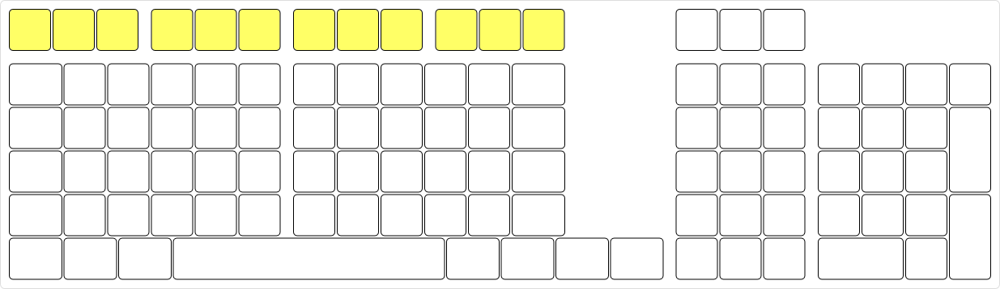

### 5. Replace the spacebar with three keys of 1.25u each.

This makes the bottom row of the left-hand and right-hand modules symmetrical and the keys uniform in size. Two keys are added in the process.

The width of the main block, now the left-hand and right-hand modules, is reduced by 2.25u.

Before:

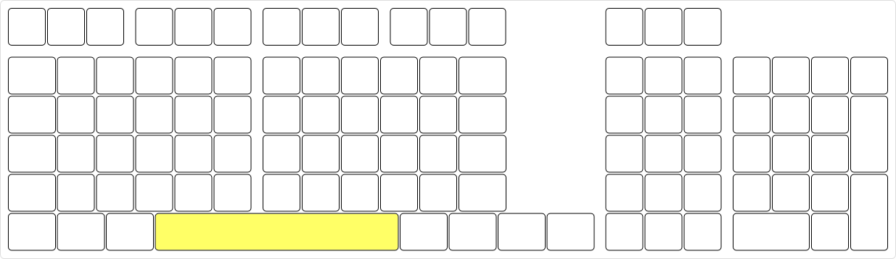

After:

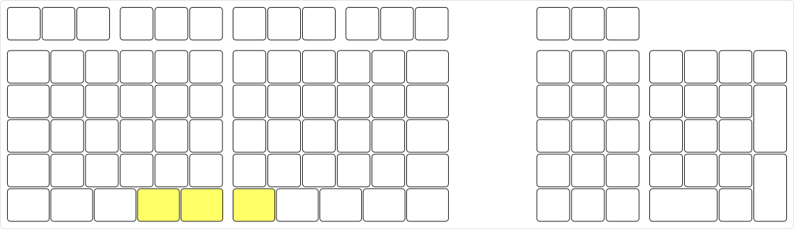

### 6. With the numeric keypad, resize the keys to 1u square and add some keys.

This makes it similar to the three-column module, but different only in the number of columns. Seven keys are added in the process.

Before:

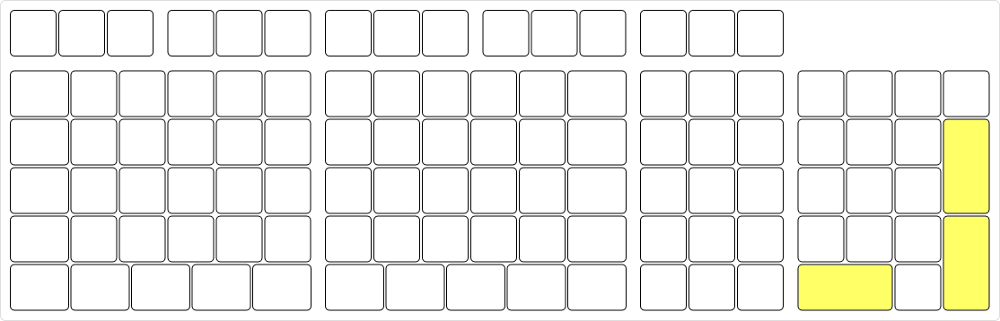

After:

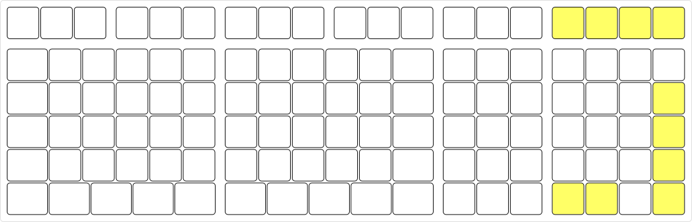
