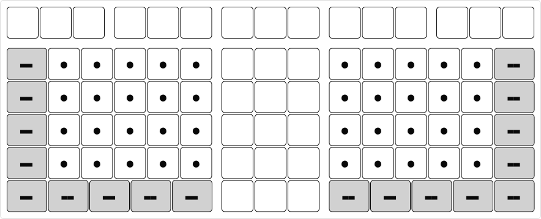

# Steimo

Steimo is a physical keyboard layout designed for modern computers.

The name Steimo is an acronym of:
* **St**raight
* **E**xternal and **I**nternal
* **Mo**dular

## Straight

The keys on a conventional keyboard are staggered. This layout was originally designed for mechanical typewriters around 150 years ago.

In a Steimo keyboard, the keys are arranged in a straight, non-staggered layout. The [center keys](glossary.md#center-keys) form straight rows and columns.

## External and Internal

The Steimo layout is designed to fit not only external keyboards but also internal (laptop) keyboards.

## Modular

The Steimo keyboard layout consists of [modules](modules.md). Modules can be added, removed, or arranged as required. It provides the option to be split or not to be split. Thus, the Steimo keyboard layout is flexible and not fixed.

## Steimo L3R

This is an example of a Steimo keyboard layout. It is called L3R because it consists of a left-hand, three-column, and right-hand modules. The three-column module in the middle increases the separation between the left and right hands. It has a compact, non-split layout and fits most laptops.

