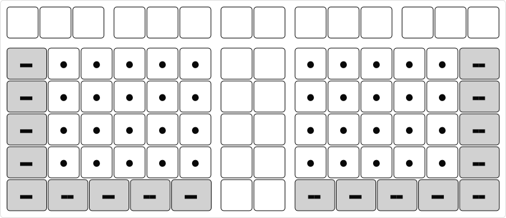

# Internal Keyboard

Internal/laptop keyboards have inherent limitations.
* The maximum keyboard size is limited by laptop size.
* The minimum number of keys cannot be too low. Otherwise, additional layers are required, which may not be available out-of-the-box prior to user setup.
* It cannot be split.
* Etc.

## Steimo L3R

The smallest Steimo layout without removing keys is L3R. It is 16u wide. This fits most laptops.

For smaller laptops, the layout is not small enough. One option is to reduce unit size. For example, if a laptop can fit up to 15u, then the unit size is reduced to 15 ÷ 16 × 19.05mm = 17.86mm. This is a 6% reduction.

There is a limit on how much a unit can be reduced while still usable.

## Steimo L2R

Another option is to use L2R, which has one less column. It is 15u wide and has 82 keys.

