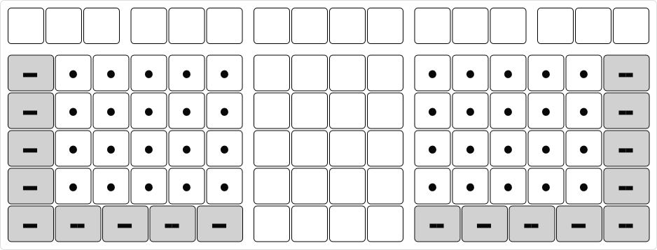
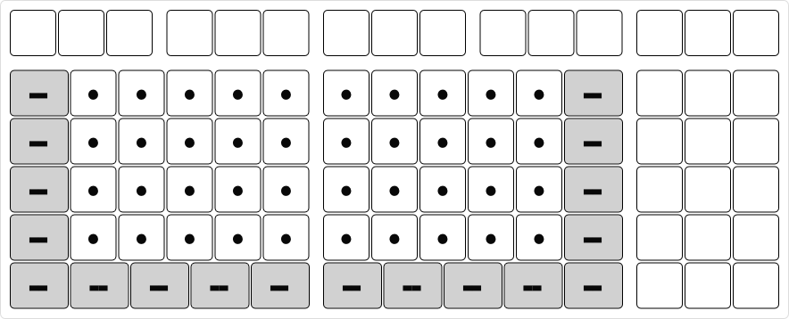

# Internal Keyboard

Internal/laptop keyboards have inherent limitations.
* The maximum keyboard size is limited by laptop size.
* The minimum number of keys cannot be too low. Otherwise, additional layers are required, which may not be available out-of-the-box prior to user setup.
* It cannot be split.
* Etc.

## Steimo L3R

The smallest Steimo configuration without removing keys is L3R. It is 16u wide. This fits most laptops.

For small laptops, it may not be small enough. One option is to reduce the unit size. For example, if a laptop can fit up to 15u, then the unit size becomes 15 ÷ 16 × 19.05mm = 17.86mm. This is a 6% reduction.

There is a limit on how much the unit size can be reduced while still usable.

## Steimo L2R

Another option for small laptops is L2R, which has one less column. It removes six keys. It is 15u wide and has 82 keys.

## Steimo L4R

This fits larger laptops. The four-column module can be configured to double function as the three-column module and as numeric keypad.

## Steimo LR3

