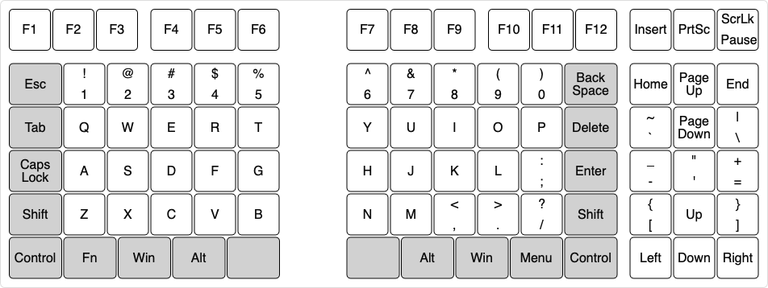
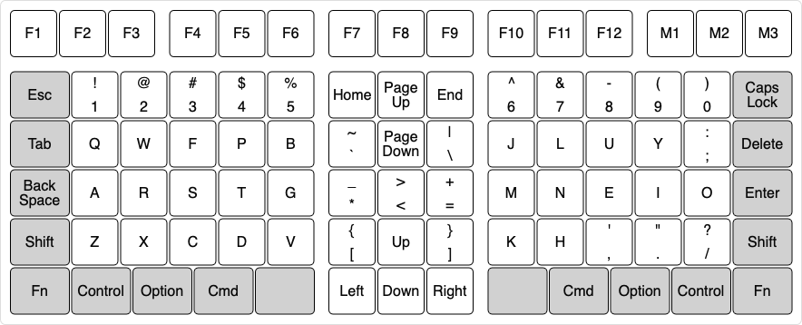

# Keyboard Layout

According to <a href="https://en.wikipedia.org/wiki/Keyboard_layout" target="_blank">Wikipedia</a>,
> A keyboard layout is any specific physical, visual, or functional arrangement of the keys, legends, or key-meaning associations (respectively) of a keyboard.
>
> * Physical layout is the actual positioning of keys on a keyboard.
> * Visual layout is the arrangement of the legends (labels, markings, engravings) that appear on those keys.
> * Functional layout is the arrangement of the key-meaning association or keyboard mapping, determined in software, of all the keys of a keyboard; it is this (rather than the legends) that determines the actual response to a key press.

## Physical Layout

Steimo is primarily a physical layout consisting of modules specified below.

## Visual Layout

Steimo does not specify any visual layout.

## Functional Layout

The only functional layout specified by Steimo is the functional guidelines in the next section.

The same physical layout can be used for different countries and languages.

## Functional Guidelines

* The [main keys](glossary.md#main-keys) should only be used for letters, numbers, punctuation, and symbols.
* Commonly used punctuation and symbols should be placed in the [main keys](glossary.md#main-keys) (rather than in the three-column module, for example), where possible.
* The [edge keys](glossary.md#edge-keys) should not be used for letters, numbers, punctuation, and symbols.

## Example: Steimo L-R3 US QWERTY Windows

In this example, note that commonly used punctuation `'`, `"`, and `-` are not yet placed in the [main keys](glossary.md#main-keys).

## Example: Steimo L3R US [Colemak-DHS](colemak-dhs.md) Mac

Note that commonly used punctuation `'`, `"`, and `-` are placed in the [main keys](glossary.md#main-keys).

