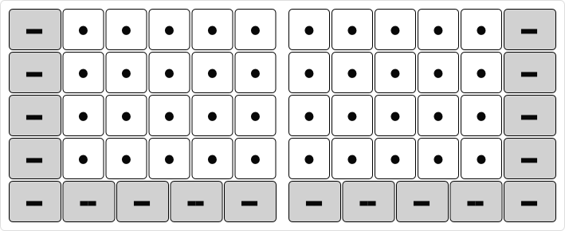
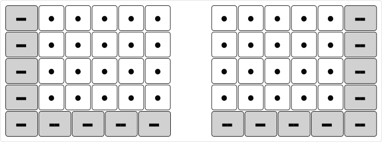

# Steimo Mini

Steimo Mini is a variant of Steimo that includes only the left-hand and right-hand modules, without the top row. It has all the [main keys](glossary.md#main-keys) and [edge keys](glossary.md#edge-keys).

It has 58 keys which is approximately 55% of a conventional keyboard.

## Steimo Mini LR

## Steimo Mini L-R

