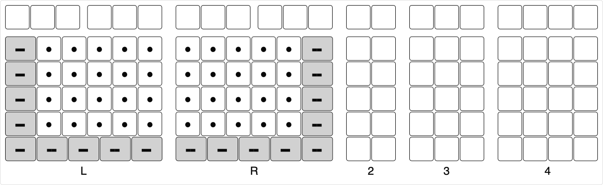

# Modules

* Left-Hand Module, **L**
* Right-Hand Module, **R**
* Two-Column Module, **2**
* Three-Column Module, **3**
* Four-Column Module, **4**

## Layout

## Module Combination

* A module combination is named by combining the abbreviated module names.
* A dash in the combination name indicates a split at that location. Multiple splits are possible.
* The combined modules must have a 0.25u gap.
* The three-column and four-column modules can be combined more than once.

Examples below.

## Steimo L3R

Note that there is a 0.25u gap between modules.

Note that there are no gaps between modules.

## Steimo L-R3

This is an example of a split.

## Steimo 4L-R3

## Steimo 4L-R4

This is an example of the same module used multiple times.

## Steimo LR34

This is the closest to a full-size conventional keyboard.

## Steimo L4R

## Steimo L-R

This requires a custom layer to access the missing keys. [Steimo Mini](mini.md) removes the top row.

## Steimo L-R-3

This is an example of multiple splits.

## Steimo L3R, Again

The above modules of L-R-3 can be arranged to form L3R. Thus, any non-split combination can be either a unibody or physically separate modules placed side-by-side.

Modules can be attached semi-permanently using magnets or other mechanisms.

